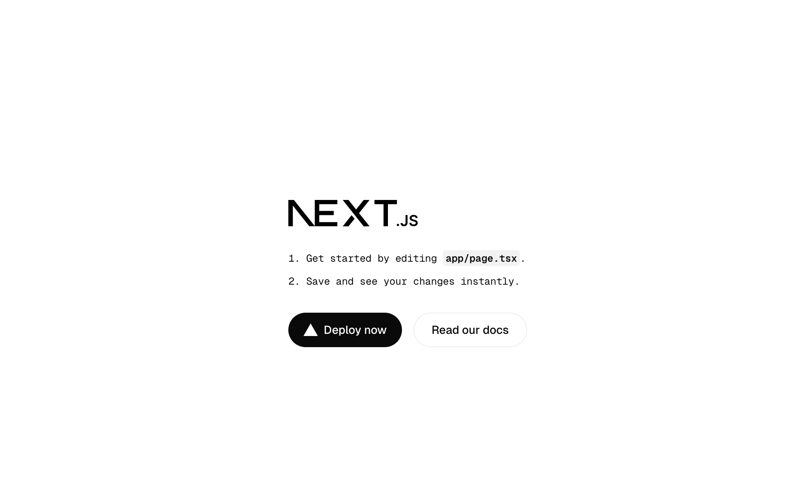
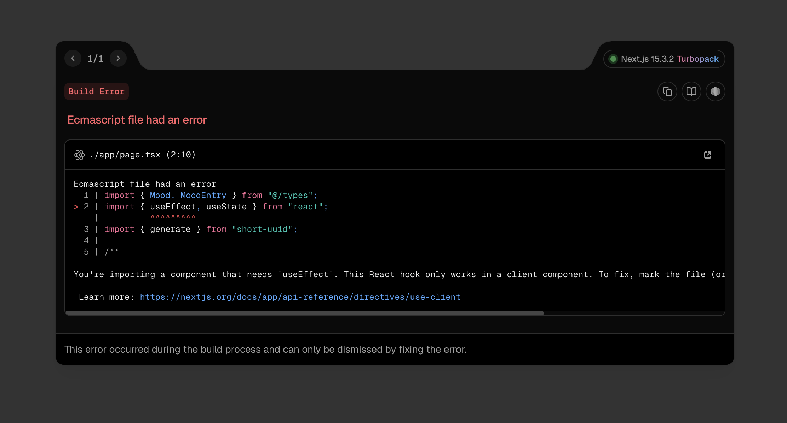
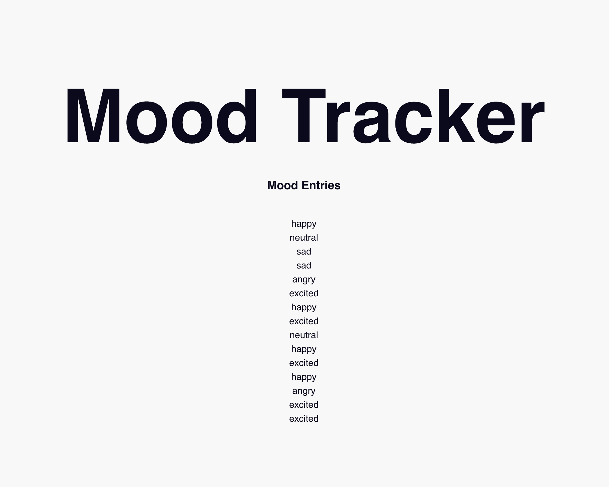
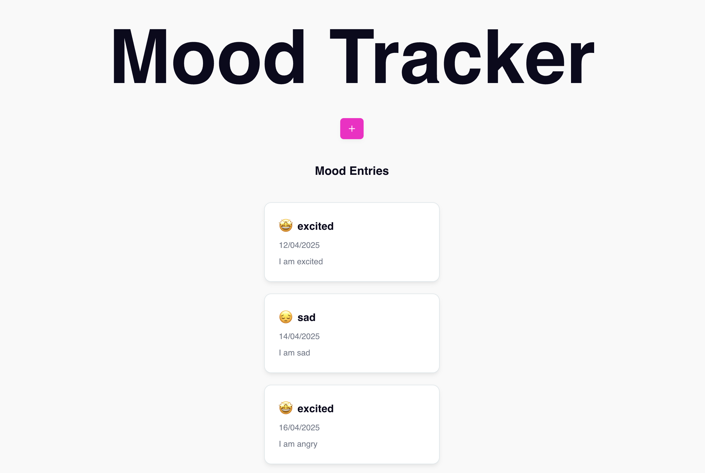
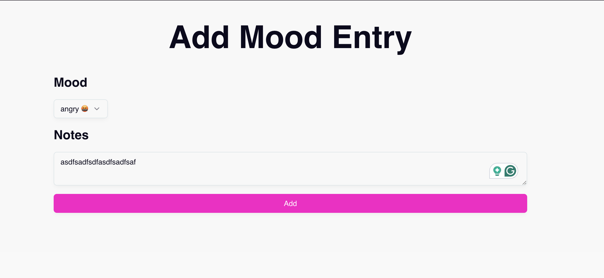

# SEM Fullstack Level 0+1 (Typescript + NodeJS + React)

| Mục                       | Nội dung                                                                                                                                                                                                                                    |
| ------------------------- | ------------------------------------------------------------------------------------------------------------------------------------------------------------------------------------------------------------------------------------------- |
| **Lv**                    | **Level 0 – Code Runner**<br>**Level 1 – Buildable Developer**                                                                                                                                                                              |
| **Tên cấp độ**            | Code Runner → Buildable Developer                                                                                                                                                                                                           |
| **Tiêu chí đạt được**     | ✅ Viết được component React đơn giản, có thể render không lỗi<br>✅ Tạo được API route NodeJS trả JSON<br>✅ Biết dùng `npm`, `tsconfig`, và `package.json` căn bản<br>✅ Tạo một fullstack app đơn giản (VD: Todo List) có thể chạy local |
| **Kỹ năng sở hữu**        | - TypeScript căn bản (kiểu, interface, function)<br>- React: JSX, useState, props<br>- NodeJS: Express route cơ bản<br>- Biết cách tổ chức project structure đơn giản<br>- Biết debug console, đọc stacktrace<br>- Git cơ bản               |
| **Thành tựu / Nhận diện** | Intern kỹ sư phần mềm / Junior mới học nghề / Student tốt nghiệp khóa code bootcamp                                                                                                                                                         |
| **Checklist kiểm chứng**  | 🔲 Todo App fullstack chạy local (Create/Delete)<br>🔲 Không lỗi syntax / runtime<br>🔲 Đẩy code lên GitHub<br>🔲 Có cấu trúc thư mục rõ ràng (src/components, src/routes, etc.)                                                            |
| **Scope ảnh hưởng**       | Chủ yếu là **bản thân**: tự build được, tự debug được, có thể nộp bài test kỹ thuật ở vòng tuyển dụng đầu vào                                                                                                                               |
| **Mindset chuyển đổi**    | 🎯 Từ “code sao cho chạy” → “code sao cho **người khác đọc được** và **có thể mở rộng**”<br>🎯 Học cách **chia nhỏ tính năng**, tách UI – logic – backend, và test từng phần                                                                |

## ToC

- [SEM Fullstack Level 0+1 (Typescript + NodeJS + React)](#sem-fullstack-level-01-typescript--nodejs--react)
    - [ToC](#toc)
    - [Tuần 1 - Typescript \& Git](#tuần-1---typescript--git)
        - [Ngày 1 - Typescript cơ bản](#ngày-1---typescript-cơ-bản)
            - [Khai báo biến](#khai-báo-biến)
            - [Các kiểu dữ liệu cơ bản](#các-kiểu-dữ-liệu-cơ-bản)
            - [Các kiểu dữ liệu chỉ "không"](#các-kiểu-dữ-liệu-chỉ-không)
                - [Khác biệt giữa `undefined`, `null` và `unknown`](#khác-biệt-giữa-undefined-null-và-unknown)
            - [any](#any)
                - [So sánh chi tiết và cách dùng](#so-sánh-chi-tiết-và-cách-dùng)
                - [Tại sao lại là `unknown`?](#tại-sao-lại-là-unknown)
            - [Các kiểu dữ liệu người dùng định nghĩa](#các-kiểu-dữ-liệu-người-dùng-định-nghĩa)
            - [Type với Interface khác nhau như thế nào](#type-với-interface-khác-nhau-như-thế-nào)
                - [Declaration Merging](#declaration-merging)
                - [So sánh chi tiết](#so-sánh-chi-tiết)
        - [Ngày 2 - Hàm số (function)](#ngày-2---hàm-số-function)
            - [Kiểu của hàm số](#kiểu-của-hàm-số)
            - [Function Expression \& Arrow function](#function-expression--arrow-function)
            - [Tham số của hàm](#tham-số-của-hàm)
                - [Tham số (tham số thông thường)](#tham-số-tham-số-thông-thường)
                - [Tham số tuỳ chọn - không bắt buộc (optional)](#tham-số-tuỳ-chọn---không-bắt-buộc-optional)
                - [Tham số "rest", "còn lại"](#tham-số-rest-còn-lại)
                - [Tham số có giá trị mặc định, `default param`](#tham-số-có-giá-trị-mặc-định-default-param)
        - [Ngày 3 - Classes \& OOP (Class và Hướng đối tượng)](#ngày-3---classes--oop-class-và-hướng-đối-tượng)
            - [OOP trong Typescript](#oop-trong-typescript)
            - [Inheritance, Abstraction \& Polimorphism](#inheritance-abstraction--polimorphism)
                - [Inheritance \& Polymorphism](#inheritance--polymorphism)
                - [Abstraction](#abstraction)
        - [Ngày 4 - git cơ bản](#ngày-4---git-cơ-bản)
            - [init](#init)
            - [add](#add)
            - [commit](#commit)
            - [git remote](#git-remote)
            - [git push](#git-push)
            - [git pull](#git-pull)
            - [git branch](#git-branch)
        - [Ngày 5 - Thực hành viết module đơn giản](#ngày-5---thực-hành-viết-module-đơn-giản)
            - [User](#user)
        - [Ngày 6 - React cơ bản](#ngày-6---react-cơ-bản)
            - [JSX - TSX](#jsx---tsx)
            - [useState](#usestate)
            - [Props](#props)
            - [Render Và Mount](#render-và-mount)
            - [Thực hành](#thực-hành)
    - [Tuần 2 - Capstone Product](#tuần-2---capstone-product)
        - [Ngày 1 - Chuẩn bị dữ liệu và service](#ngày-1---chuẩn-bị-dữ-liệu-và-service)
            - [Chuẩn bị kiểu dữ liệu](#chuẩn-bị-kiểu-dữ-liệu)
            - [Chuẩn bị MoodService](#chuẩn-bị-moodservice)
        - [Ngày 2 - Chuẩn bị giao diện](#ngày-2---chuẩn-bị-giao-diện)
            - [Components](#components)

## Tuần 1 - Typescript & Git

### Ngày 1 - Typescript cơ bản

#### Khai báo biến

Để khai báo biến trong **Typescript** dùng `let` hoặc `const`.

- `let`: dùng để khai báo biến bình thường, có thể thay đổi giá trị
- `const`: dùng để khai báo hằng số, không thể thay đổi giá trị

#### Các kiểu dữ liệu cơ bản

- `string`: chuỗi, được thể hiện bằng `""` hoặc `''`. Ví dụ: `"đây là một chuỗi"`
- `number`: số, có thể là số nguyên, hoặc số có dấu chấm động. Ví dụ: `1`, `1.234`
- `boolean`: có hai giá trị `true` hoặc `false`

#### Các kiểu dữ liệu chỉ "không"

- `undefined`: chưa khai báo
- `null`: null
- `unknown`: chưa biết

##### Khác biệt giữa `undefined`, `null` và `unknown`

**1. undefined**

Nói là: _**giá trị của tôi chưa được khai báo**_, **không** khai báo giá trị

`undefined` là giá trị mặc định của mọi biến.

```typescript
let a: number;
console.log(a); // undefined

function getAThing(): void {
    return; // undefined
}
```

**2. null**

Nói là: _**Giá trị của tôi là "không có giá trị gì hết, rỗng"**_, **không** có giá trị, là **rỗng**

`null` thường được chủ đích dùng khi muốn nói là, dữ liệu là "rỗng", thường dùng trong database và thuật toán

```typescript
type Something = string | null;
function getSomething(): Something {
    return null;
}
```

**3. unknown**

Nói là: **Không** biết kiểu dữ liệu sẽ là gì, cần kiểm tra trước khi dùng.

#### any

Kiểu dữ liệu `any` là một kiễu dữ liệu thể hiện sự chặc chẽ yếu, nói rằng, _"Kiểu nào cũng được"_.

```typescript
type SomeType = {
    name: string;
};

function log(a: any) {
    console.log(a);
}

const s1: SomeType = {
    name: 'name1',
};

log(s1);
log(1);
lgo('hehe');
```

##### So sánh chi tiết và cách dùng

| Thuộc tính            | `any`                                | `unknown`                         | `null`                        | `undefined`                                   |
| --------------------- | ------------------------------------ | --------------------------------- | ----------------------------- | --------------------------------------------- |
| Là kiểu dữ liệu       | ✅                                   | ✅                                | ✅                            | ✅                                            |
| Là giá trị cụ thể     | ❌                                   | ❌                                | ✅                            | ✅                                            |
| Cho phép dùng bất kỳ  | ✅ (nguy hiểm)                       | ❌ Phải kiểm tra trước            | ❌ Không dùng như hàm/hành vi | ❌ Không dùng như hàm/hành vi                 |
| An toàn               | ❌ Không                             | ✅ Rất an toàn                    | ✅ Nếu dùng có chủ đích       | ⚠️ Cẩn thận — có thể là lỗi                   |
| Dùng như gì cũng được | ✅                                   | ❌                                | ❌                            | ❌                                            |
| Thường dùng khi nào   | Khi cần “tắt” kiểm tra kiểu tạm thời | Khi cần nhận giá trị chưa rõ kiểu | Để biểu thị "rỗng" có chủ ý   | Biến chưa được gán hoặc kết thúc không trả về |
| Có trong JavaScript?  | ❌ (chỉ TS)                          | ❌ (chỉ TS)                       | ✅                            | ✅                                            |

##### Tại sao lại là `unknown`?

**Typescript** với hệ thống kiểm tra kiểu dữ liệu sẽ chỉ có thể giúp chúng ta trong build time, tức là trong lúc code và đến trước khi compile sang javascript. Còn trong runtime, lúc chương trình được chạy, **SẼ KHÔNG CÓ BẤT KÌ KIỂM TRA KIỂU NÀO** nếu chúng ta không chủ đích kiểm tra bằng runtime type check (toán tử _typeof_, _instanceof_).

Vì lí do này, `unknown` hiện lên như một lời nhắc nhỡ, **"Hãy check kiểu của cái này đi, biết kiểu rồi hãy thực hiện logic, nguy hiểm đó".** vì nếu một dữ liệu có kiểu `unknown` compiler sẽ yêu cầu thực hiện kiểm tra kiểu trước khi truy cập vào, properties, methods hoặc prototype và điều đó giúp giảm thiểu lỗi xảy ra ở runtime do sai kiểu dữ liệu.

> ‼️ Kiểm tra kiểu liên tục sẽ làm giảm performance của hệ thống, typeof, instanceof hoặc các hàm kiểm tra kiểu built-in thì không đáng kể, còn lại chỉ nên check kiểu tại runtime khi thực sự quan trọng. Có thể dùng thư viện như **zod**, cho các kiểu phức tạp.

#### Các kiểu dữ liệu người dùng định nghĩa

- `type`: dùng để định nghĩa một kiểu

```typescript
type MyType = string;

type MyOtherType = {
    name: string;
    age: number;
};
```

- `interface`: dùng để định nghĩa một interface. Ví dụ

```typescript
interface MyInterface {
    method1: (param1: string) => void;
}

interface MyOtherInterface {
    name: string;
    age: string;
}
```

#### Type với Interface khác nhau như thế nào

Về mặt bản chất, `interface` thể hiện một bản _"hợp đồng"_, mọi instance tuân theo `interface` thì sẽ tuân theo bản hợp đồng này. Còn `type` lại giống như một _"biệt danh"_ giúp cho chúng ta có thể dễ dàng và linh hoạt hơn trong việc thể hiện kiểu dữ liệu.

Về mặt tính chất kỹ thuật `interface` hỗ trợ `declaration merging` còn `type` thì không, ở chiều ngược lại `type` hỗ trợ các phép toán trên kiểu dữ liệu như _union_, _intersection_, còn `interface` thì không.

##### Declaration Merging

Typescript cho phép khai báo một `interface` nhiều lần, và compiler sẽ tự động merge các khai báo của interface lại.

```typescript
// Declaration merging
interface MyType {
    hi: () => void;
}

interface MyType {
    name: string;
}

const myTypeInstance: MyType = {
    name: 'Max',
    hi: () => console.log('My name is Max'),
};
```

##### So sánh chi tiết

| Feature                  | `interface`            | `type`                         |
| ------------------------ | ---------------------- | ------------------------------ |
| Basic Object Shape       | ✅ Yes                 | ✅ Yes                         |
| Union & Intersection     | ❌ No                  | ✅ Yes                         |
| Declaration Merging      | ✅ Yes                 | ❌ No                          |
| Extending                | ✅ Yes (via `extends`) | ✅ Yes (via `&` operator)      |
| Implements (in classes)  | ✅ Yes                 | ✅ Yes                         |
| Primitives, Tuples, etc. | ❌ No                  | ✅ Yes                         |
| Better for OO Design     | ✅ Yes                 | ⚠️ Possible, but not idiomatic |

### Ngày 2 - Hàm số (function)

Hàm số là một đơn vị đóng gói cơ bản của logic. trong **Typescript**, hàm số được khai báo theo cú pháp sau, gọi là `function declaration`.

```typescript
function <Tên hàm số>(param1:<kiểu param 1>, param2: <kiểu param 2>):<kiểu trả về>{
    // Logic ở đây
}
```

Ví dụ

```typescript
// Hàm không có param (tham số)
function callMeMaybe(): void {
    console.log('Call me maybe');
}

// Hàm có param
function callMeByYournam(yourname: string): void {
    console.log(`Call me: ${yourname}`);
}

function add(a: number, b: number): number {
    return a + b;
}
```

Hàm số có thể trả về giá trị hoặc không, dùng từ khoá `return` để trả về giá trị cho hàm số.

Hàm số có thể được định nghĩa kiểu trả về hoặc không, mặc định là `void`, `void` nói rằng hàm này sẽ không trả về giá trị, không cần hứng nó. **Vậy nếu cố tình hứng thì sao?**

```typescript
type func = () => void;

const a: func = () => console.log();

const b = a();
console.log(b); //undefined
```

`undefined` sẽ là giá trị mặc định trả về cho hàm `void`, nhưng như đã nói, không nên quan tâm đến gía trị trả về của hàm được định nghĩa là `void`.

#### Kiểu của hàm số

Hàm số trong **Typescript** có một kiểu chung (dạng WrapperClass) gọi là **Function**,nhưng kiểu này rất chung chung và không đáng tin cậy.

Mỗi dạng hàm số trong Typescript sẽ có một kiểu riêng, gọi là **Signature (chữ ký)**, chữ ký này là tổng hợp của:

- Số lượng tham số của hàm
- Kiểu của các tham số đó

Ví dụ:

```typescript
function add(a: number, b: number): number {
    return a + b;
}

// Signature là (number,number)

function add2(a: number, b: number): string {
    return (a + b).toString();
}

// Signature là (number,number)
```

**‼️‼️‼️ KIỂU TRẢ VỀ SẼ KHÔNG ĐƯỢC XÉT TRONG SIGNATURE**

**‼️‼️‼️ HAI HÀM CÓ CHUNG SIGNATURE KHÔNG ĐƯỢC TRÙNG TÊN**

#### Function Expression & Arrow function

Ngoài cách khai báo bên trên, chúng ta có thể khai báo hàm như một expression (có thể không cần tên), cách này còn được gọi là `Nameless function`.

```typescript
const a = function (a: number, b: number): number {
    return a + b;
};

a(1, 2); // 3

// Signature (number, number)
```

Hoặc có thể bằng **Arrow function**

```typescript
const a = (a: number, b: number) => number {
    return a + b;
}

a(1,2); // 3

// Signature (number, number)
```

Điểm khác biệt có thể nhìn thấy rõ ràng nhất là cả hai cách này cần một biến để gán vào và dùng biến đó như tên để gọi hàm.

Khác biệt chi tiết hơn so với **Function declaration** là

| Đặc điểm                   | `function declaration`         | `function expression` (nameless)  | `arrow function`                         |
| -------------------------- | ------------------------------ | --------------------------------- | ---------------------------------------- |
| **Cú pháp**                | `function name(...) {}`        | `const x = function (...) {}`     | `const x = (...) => {}`                  |
| **Có tên không?**          | ✅ Luôn có                     | ❌ Có thể không (và thường không) | ❌ Không có tên riêng                    |
| **Khai báo hoisted?**      | ✅ Hoisted toàn bộ             | ❌ Không hoisted                  | ❌ Không hoisted                         |
| **Gán vào biến?**          | ❌ Không cần (tự có tên)       | ✅ Cần gán để dùng                | ✅ Cần gán để dùng                       |
| **`this` binding**         | ✅ Dynamic — phụ thuộc context | ✅ Dynamic — phụ thuộc context    | 🚫 Lexical — lấy `this` từ phạm vi ngoài |
| **Dùng làm constructor**   | ✅ Có thể                      | ✅ Có thể                         | ❌ Không thể (`TypeError`)               |
| **Có `arguments` object?** | ✅ Có                          | ✅ Có                             | ❌ Không có `arguments`                  |
| **Thích hợp cho**          | Hàm cấp cao, public, khởi tạo  | Callback, gán biến, IIFE          | Callback ngắn gọn, không cần `this`      |

_hoisted_ có thể hiểu đơn giản là "kéo lên", tức là Javascript sẽ thực hiện "kéo" các khai báo này lên phần dành cho khai báo biến và hàm trước khi bắt đầu thực thi.

**Function declaration** được kéo lên, còn hai kiểu khai báo còn lại thì không.

```typescript
const sum = add(1, 2);

function add(a: number, b: number): number {
    return a + b;
}
```

Đoạn code này sẽ **KHÔNG LỖI** gì khi chạy cả, vì khai báo hàm _add_ sẽ được kéo lên trước dù hiện tại ta thấy nó được khai báo sau khi dùng.

```typescript
const sum = add(1, 2);

const add = function (a: number, b: number): number {
    return a + b;
}; // Lỗi thực thi
```

Đoạn code này bị **LỖI THỰC THI**, _add_ được gọi trước khi khai báo.

#### Tham số của hàm

Dù được khai báo như thế nào thì thành phần quan trọng nhất tạo ra signature cho hàm là các tham số.

##### Tham số (tham số thông thường)

Là các tham số được nêu tên trong phần khai báo tham số trong hàm, và **BẮT BUỘC** phải có giá trị khi gọi hàm.

```typescript
function add(a: number, b): number {
    return a + b;
}

add(1, 2); // 3
add(1); // Error, không đủ tham số đầu vào

function add(a: number, b: number | undefined) {
    if (b === undefined) {
        return a;
    }

    return a + b;
}

add(1, 2); // 3
add(1); // Error, thiếu tham số đầu vào
add(1, undefined); // 1
```

##### Tham số tuỳ chọn - không bắt buộc (optional)

Là tham số, có thể được truyền vào hàm, hoặc không (nếu không, `undefined` sẽ là giá trị của tham số đó).

```typescript
function add(a: number, b?: number) {
    if (b === undefined) {
        return a;
    }

    return a + b;
}

add(1, 2); // 3
add(1); // 1
add(1, undefined); // 1
```

Tham số tuỳ chọn sẽ không bị lỗi thực thi nếu chúng ta không truyền giá trị vào lời gọi hàm.

> ‼️ Các tham số tuỳ chọn luôn nên được để sau cùng của hàm.

##### Tham số "rest", "còn lại"

Tham số `rest` là một dạng tham số đặc biệt, nó là một mảng, chứa các tham số từ vị trí được khai báo trở về sau.

```typescript
// Mọi tham số từ vị trí 0 sẽ được gôm vào rest tên là items
function add(...items: number[]): number {
    return items.reduce((a, b) => a + b, 0);
}

add(); // 0
add(1, 2, 3); // 6
add(1, 2, 3, 4); // 10

// Mọi tham số từ vị trí 1 sẽ được gôm vào rest tên otherItems
function add(a: number, ...otherItems: number[]): number {
    return a + otherItems.reduce((a, b) => a + b, 0);
}

add(); // Error, thiếu tham số
add(1); // 1
add(1, 2, 3, 4); // 10
```

##### Tham số có giá trị mặc định, `default param`

Đây là cách khai báo một tham số mà có thể gán giá trị mặc định cho nó khi không có giá trị truyền vào, có thể coi đây là một biến thể của tham số tuỳ chọn.

```typescript
function add(a: number, b: number = 1): number {
    return a + b;
}

add(1); // 2
add(1, 2); // 3
```

### Ngày 3 - Classes & OOP (Class và Hướng đối tượng)

`OOP (Object-Oriented Programming)` lập trình hướng đối tượng là một trường phái lập trình mô phỏng đối tượng trong thực tế.

Khái niệm cơ bản:

- `Class (lớp)`: class có vai trò như là một bản thiết kế (blueprint), chỉ định rằng đối tượng sẽ có `properties (dữ liệu)` và `methods (hành vi)` gì.
- `Object / instance (đối tượng)`: là một "cụ thể hoá" của class, chứa dữ liệu thực và hành vi tác động đến dữ liệu thực.

Ví du:

Chúng ta đang làm một hệ thống quản lý thư viện cho nhà trường, trong đó, sách có các dữ liệu như:

- Tên (title)
- Tác giả (author)
- Thể loại (genres)
- Năm xuất bản (published year)

Những dữ liệu trên này gọi là `properties`. Và sách có thể được mượn và trả

- Mượn (borrow)
- Trả (return)

Các hành vi đến sách này gọi là `methods`

Vậy là chúng ta đã có định nghĩa cho class `Book`.

Quyển `Cuốn theo chiều gió` của `Margaret Mitchell` thuộc thể loại `Tiểu thuyết` được phát hành (tái bản) năm `2024` là một cụ thể hoá của class Book, nó sẽ được gọi là một `object hoặc một instance`.

**OOP** có 4 tính chất chính:

- `Encapsulation (đóng gói)`: "giấu" dữ liệu và hành vi, không cho người dùng (class khác, đối tượng khác) biết được, dùng được hoặc suy đoán được.
- `Inheritance (kế thừa)`: có thể kế thừa bản thiết kế từ class khác để tạo nên một bản thiết kế **cụ thể, chi tiết hơn**.
- `Polymorphism (đa hình)`: với cùng một thiết kế, có thể có những hành vi cụ thể khác nhau, ví dụ, hành vi mượn sách, mượn có thể có thời hạn khác nhau phụ thuộc vào cấp bậc của người mượn chẵn hạn.
- `Abstraction (trừu tượng)`: tạo một giới hạn trách nhiệm của class, qua đó thông báo cho người dùng (class khác, đối tượng khác) biết được nó có thể **làm** gì mà không cần biết cụ thể nó sẽ làm như thế nào.

#### OOP trong Typescript

Trong **Typescript** chúng ta có thể khai báo một class bằng từ khoá `class`.

```typescript
class Book {
    // properties
    // methods
}
```

Trong mỗi class declaration sẽ có một phương thức đặc biệt gọi là `constructor (phương thức khởi tạo)`. Constructor sẽ được gọi khi mà một instance mới được tạo ra bằng từ khoá `new`. Trong Typescript chúng ta có thể khai báo constructor tường minh hoặc không.

```typescript
class Book {
    // properties
    // methods
    constructor() {}
}
```

Constructor tuân thủ theo mọi quy ước của hàm số.

Để có thể **đóng gói** dữ liệu và hành vi, Typescript cung cấp một bộ `Access Modifier`:

- _public (default)_: cho phép mọi người dùng có thể đọc/ghi/gọi.
- _private_: không cho phép bất kỳ ai ngoại trừ chính bản thân class hiện tại đọc/ghi/gọi.
- _protected_: cho phép mọi class kế thừa từ class hiện tại có thể đọc/ghi/gọi.

Ngoài ra, còn một cách kiểm soát mềm đối với dữ liệu đó là `readonly`, khi properties được gán readonly thì kể từ sau khi được gán giá trị lần đầu, nó sẽ không được phép gán lại giá trị nữa.

```typescript
class Book {
    private title: string;
    private author: string;
    private publishedYear: string;

    constructor(title: string, author: string, publishedYear: string) {
        this.title = title;
        this.author = author;
        this.publishedYear = publishedYear;
    }

    public borrow() {
        console.log(`Borrowed: ${this.title}`);
    }

    public return() {
        console.log(`Returned: ${this.title}`);
    }
}

const goneWithTheWind = new Book('Gone With The Wind', 'Margaret Mitchell', 2024);

console.log(goneWithTheWind.title); //Syntax error, the title is private, cannot be access by the outer consummers.

goneWithTheWind.borrow(); // 'Borrowed: Gone With The Wind'
```

Để kiểm tra một instance có phải thuộc một class cụ thể nào đó hay không, chúng ta có thể dùng toán tử `instanceof`.

Ví dụ:

```typescript
console.log(goneWithTheWind instanceof Book); // true
```

`instanceof` sẽ kiểm tra `prototype` của instance với prototype của class và cũng không phụ thuộc vào interface hay type.

> ‼️‼️ Không dùng instanceof với interfaces hoặc types

#### Inheritance, Abstraction & Polimorphism

Trong Typescript, kế thừa, trừu tượng và đa hình cũng sẽ được thể hiện.

##### Inheritance & Polymorphism

Một class có thể kế thừa lại một class khác, dùng từ khoá `extends` (đừng nhầm với type extends).

```typescript
class Book {
    constructor(
        private title: string,
        private author: string,
        private genre: string[]
    ) {}

    borrow() {
        console.log(`Borrow: ${this.title}`);
    }

    return() {
        console.log(`Return: ${this.title}`);
    }
}

class Ebook extends Book {
    constructor(
        private title: string,
        private author: string,
        private genre: string[],
        private server: string
    ) {
        super(title, author, genre);
    }

    // Overriding
    borrow() {
        console.log(`EBorrow: ${this.title}`);
    }

    download() {
        console.log(`Download: ${this.title}`);
    }
}

const gwtwEbook = new Ebook('Gone With The Wind', 'Margaret Mitchell', 2024, 'Server1');

gwtwEbook.borrow(); // EBorrow: Gone With The Wind
gwtwEbook.return(); // Returned: Gone With The Wind
gwtwEbook.download(); // Download: Gone With The Wind
```

Một class kế thừa một class khác có thể bổ sung "dữ liệu" hoặc "hành vi" cụ thể chi tiết hơn, như trong ví dụ trên, Ebook cần có thêm **server** và **download**.

Class kế thừa cũng có thể `override (ghi đè)` lại hành vi của class được kế thừa. **Ebook** đã override lại **borrow** của **Book**.

Vậy nếu chúng ta có thêm một class khác cũng kế thừa từ `Book`.

```typescript
class HardcoverBook extends Book {
    borrow() {
        console.log(`Borrow hardcover book: ${this.title}`);
    }
}

function main() {
    const books: Book[] = [
        new Ebook('Gone With The Wind', 'Margaret Mitchell', 2024, 'Server1'),
        new HardcoverBook('Gone With The Wind', 'Margaret Mitchell', 2024),
    ];

    for (const b of books) {
        b.borrow();
    }
}

main();
// Eborrow: Gone With The Wind
// Borrow hardcover book: Gone With The Wind
```

Khả năng tìm đến thực thi phù hợp cho từng class cụ thể, gọi là `polymorphism (đa hình)`.

##### Abstraction

`interface` và `implements` là hai từ khoá giúp Typescript thực hiện tính chất Abstraction trong OOP.

`interface` là bản hợp đồng, cho biết những người tuân theo hợp đồng này có thể làm gì (what) nhưng không quan tâm là làm như thế nào (how).

`implements` là từ khoá giúp một class hiện tự hoá, định nghĩa hành vi theo hợp đồng / interface nhất định (có thể là một hoặc nhiều).

```typescript
interface IBorrowable {
    borrow: () => void;
}

class Book implements IBorrowable {
    borrow() {
        console.log('Borrow book');
    }
}

class Pen implements IBorrowable {
    borrow() {
        console.log('Borrow pen');
    }
}

function main() {
    const borrowableList: IBorrowable[] = [new Book(), new Pen()];

    for (const borrowable of borrowableList) {
        borrowable.borrow();
    }
}

main();
```

Trong ví dụ trên, `IBorrowable` định nghĩa một hợp đồng, nói rằng mọi class tuân theo hợp đồng này đều có một phương thức _borrow_.

`Book` và `Pen` hiện thực hoá `IBorrowable` bằng cách `implements` phương thức _borrow_ theo cách riêng của từng class.

Hàm `main`, biết rằng, trong borrowableList, mỗi item đều có thể gọi _borrow_, nhưng hàm main sẽ không quan tâm phương thức _borrow_ của mỗi item được hiện thực hoá như thế nào.

Chúng ta cũng có thể tạo một kiểu trừu tượng khác bằng từ khóa `abstract`.

```typescript
abstract class Borrowable {
    title: string;

    return(): void {
        console.log(`Returned: ${this.title}`);
    }

    abstract borrow(): void {
        // Không có định nghĩa trong này
        // Phương thức trừu tượng phải rỗng
    }
}
```

`abstract` class sẽ nhắc các class kế thừ từ nó phải hiện thực hoá phương thức _borrow_. Abstract class còn cho phép chúng ta hiện thực hoá một phần, _return_ là phần hiện thực mặc định cho hành vi _trả sách_ nhưng nếu không thích thì các class kế thừa có thể "ghi đè".

Điều cần chú ý là abstract class **KHÔNG THỂ TỰ TẠO INSTANCE**, tức là nó không thể sử dụng với `new` và không có `constructor`.

Buộc phải tạo một class khác để kế thừa và tạo instance thông qua class kế thừa đó.

**So sánh abstraction bằng `interface` và bằng `abstract class`**:

| Tiêu Chí                                       | **Interface**                                                                                          | **Abstract Class**                                                                                                      |
| ---------------------------------------------- | ------------------------------------------------------------------------------------------------------ | ----------------------------------------------------------------------------------------------------------------------- |
| 🧑‍🏫 **Khái Niệm Chính**                         | Định nghĩa _hợp đồng_ (contract) — chỉ nói **"bắt buộc phải có gì"**, không nói **"làm như thế nào"**. | Định nghĩa _hợp đồng + một phần triển khai_ — nói **"bắt buộc phải có gì"** và **"cái gì đã có sẵn"**.                  |
| 🧱 **Triển Khai Logic Sẵn (Implementation)**   | ❌ Không thể có logic sẵn.                                                                             | ✅ Có thể cung cấp logic mặc định cho một số phương thức.                                                               |
| 🛠️ **Ép buộc Phải Triển Khai**                 | ✅ Bắt buộc tất cả các phương thức, property được khai báo phải được triển khai.                       | ✅ Tương tự, nhưng có thể có **method đã được cài sẵn** nên không bắt buộc phải override tất cả.                        |
| 🧬 **Kế thừa (Inheritance)**                   | ✅ Hỗ trợ **đa kế thừa** (implement nhiều interface cùng lúc).                                         | ❌ Chỉ kế thừa **một abstract class** (single inheritance).                                                             |
| 🧑‍💻 **Kiểu Runtime (Thực thi)**                 | ❌ **Không tồn tại ở runtime** — chỉ tồn tại trong compile-time.                                       | ✅ **Tồn tại ở runtime** dưới dạng **class** — có thể kiểm tra bằng `instanceof`.                                       |
| 🛑 **Hạn chế Kiểm Tra Runtime (`instanceof`)** | ❌ Không kiểm tra được bằng `instanceof`.                                                              | ✅ Kiểm tra được bằng `instanceof`.                                                                                     |
| 🧠 **Mục đích Sử Dụng**                        | Định nghĩa **hợp đồng** cho behavior/phân vai (role-based behavior), **nhẹ, không logic**.             | Định nghĩa **cấu trúc + một phần logic sẵn**, thích hợp cho **cây thừa kế phức tạp** hoặc **skeleton implementations**. |
| ⚡ **Dùng Khi Nào?**                           | - Muốn mô tả **nhiều vai trò**. <br> - Cần **đa kế thừa** behavior.<br> - Không cần logic có sẵn.      | - Muốn **tái sử dụng một phần logic**. <br> - Cần **tạo bộ khung** cho hệ thống **theo thứ bậc**.                       |
| 💼 **Ví dụ Thực Tế**                           | `Drawable`, `Serializable`, `Logger`, `Borrowable`, `Plugin`                                           | `AbstractAnimal`, `AbstractPaymentMethod`, `BaseComponent`, `BaseController`                                            |

Một lưu ý khi đụng đến kế thừa trong OOP.

> ‼️‼️ Prefer composition over inheritance.
> (Kết hợp nhiều class sẽ tốt hơn là kế thừa)

Điều này không có nghĩa là _không được kế thừa_, nhưng ý nói là, nếu có thể hiện thực hoá một hành vi bằng cách kết hợp các class riêng lẻ lại với nhau, hãy chọn cách đó.

Khi một class được định nghĩa bởi `inheritance` chúng ta nói nó **"cũng là"**, khi được định nghĩa bởi `composition` chúng ta nói nó **"cũng có thể"**.

```typescript
class Character {
    move() {
        console.log('Walking');
    }
}

class FlyingCharacter extends Character {
    move() {
        console.log('Flying');
    }
}

class SwimmingCharacter extends Character {
    move() {
        console.log('Swimming');
    }
}
```

Trong cách code trên, thông qua kế thừa từ **Character**, chúng ta định nghĩa từng loại character với cách di chuyển khác nhau, như là: đi, bay, bơi,... Vậy nếu muốn một character vừa bay được vừa bơi được thì chúng ta sẽ phải tiếp tục định nghĩa thêm một class `FlyingAndSwimmingCharacter`.

Điều này, làm cho code khó mở rộng vì phải liên tục tạo mới các class để cho từng loại character khác nhau.

Vậy để dễ mở rộng hơn, và không định nghĩa character "là" nữa, mà dựa trên "có thể làm" chúng ta sẽ gôm những hành vi di chuyển ra, và không để Character bị phụ thuộc vào nó nữa.

```typescript
interface MovementBehavior {
    move: () => void;
}

class FlyingBehavior implements MovementBehavior {
    move() {
        console.log('Flying');
    }
}

class SwimmingBehavior implements MovementBehavior {
    move() {
        console.log('Swimming');
    }
}

class Character {
    constructor(private movements: MovementBehavior[]) {}

    move() {
        for (const mv of this.movements) {
            mv.move();
        }
    }
}

function main() {
    const swimmingChar = new Character([new SwimmingBehavior()]);
    const flyingChar = new Character([new FlyingBehavior()]);
    const swimmingAndFlyingChar = new Character([new SwimmingBehavior(), new FlyingBehavior()]);

    swimmingChar.move();
    fllyingChar.move();
    swimmingAndFlyingChar.move();
}

main();
```

Truyền hành vi vào tức là `composition`.

Tại sao lại nên chọn `composition` hơn là `inheritance`:

- Không giới hạn số hành vi
- Dễ mở rộng
- Có thể thay đổi hành vi một cách linh hoạt
- Tuân thủ theo nguyên lý `open/closed`

### Ngày 4 - git cơ bản

#### init

Tạo một git repo mới tại local, chỉ chạy một lần.

```bash
git init
```

#### add

Dùng để stage một thay đổi

```bash
git add <path_to_file>
git add . # Thêm toàn bộ file đã thay đổi
```

#### commit

Dùng để commit một thay đổi trong file system.

```bash
git commit # commit thay đổi
git commit -m "<message>" # commit thay đổi với message
```

#### git remote

Dùng để thêm, xoá, thay đổi remote repository link với local repository, như github, bitbucket, gitlab

```bash
git remote add origin <url> # Thêm một remote path
git remote set origin <url> # Thay đổi url của một remote URL
git remote -v # List tất cả remote link
git remote remove <name> # Xoá remote khỏi git hiện tại
```

#### git push

Dùng để đẩy thay đổi (các commit) trong branch hiện tại lên trên remote repository.

```bash
git push
```

#### git pull

Dùng để kéo các thay đổi (commits) từ remote repository về branch hiện tại

```bash
git pull
git pull origin main # Kéo các thay đổi từ branch main của origin remote và merge vào branch hiện tại
```

#### git branch

Dùng để thực hiện các thao tác với branch

```bash
git branch -v # list tất cả các branch
git branch -b <new_branch> # Tạo branch mới "based on" code của branch hiện tại (kể cả chưa commit và chưa stag)
git branch -D <branch> # Xoá một branch ở local, điều kiện là hiện đang không ở branch đó
```

### Ngày 5 - Thực hành viết module đơn giản

Chúng ta sẽ thực hành viết một module cho việc quản lý người dùng, với tính năng đơn giản là CRUD (Create, Read, Update, Delete).

Toàn bộ code có thể được tìm thấy ở [practices/crud_users.ts](./practices/crud_user.ts)

#### User

Định nghĩa một type `User` với username, password và email

```typescript
type User {
    username: string;
    pasword: string;
    email?: string;
}
```

Hiện thực class `UserManager` hoặc `UserService` để code logic quản lý users.

Hiện tại sẽ chỉ dùng in-memory list của User, chưa cần quan tâm đến Database.

Yêu cầu:

- [ ] in-memory list không được nhìn thấy và truy cập bởi bên ngoài
- [ ] Kiểm tra xem `username` có tồn tại hay không, trước khi thực hiện Thêm, Xoá, Sửa và trả về lỗi `User already exists` (cho create) hoặc `User not found` nếu không tìm thấy (cho update và delete).
- [ ] Hiện thực thêm user vào in-memory list
- [ ] Hiện thực update user information
- [ ] Hiện thực xoá user khỏi in-memoty list
- [ ] Hiện thựac hoá tìm user bằng username, tìm bằng email hoặc tìm bằng cả hai

### Ngày 6 - React cơ bản

#### JSX - TSX

Là khả năng cho phép viết html-tag like trong file .jsx hoặc .tsx, nói chung là gần giống html nhưng trong file có thể hiểu được javascript và typescript.

```typescript
export default ComponentA(){
    return <div>
        <button> This is a button </button>
    </div>
}
```

#### useState

Một component có thể có `state` hoặc là không có state, component mà không có state gọi là `stateless` còn component có state gọi là `stateful`. Vậy state là gì? `state` tức là dữ liệu thuộc riêng về component đó.

```typescript
// Stateless component
export function ComponentA(){
    return <div>
        <button> This is a button </button>
    </div>
}

export function ComponentB(props: {meesage:string}){
    return <div>
        <button> {props.message} </button>
    </div>
}
```

`ComponentA` là stateless component vì nó không có dữ liệu tự thân nào hết. `ComponentB` cũng là stateless component, tuy rằng nó có nhận dữ liệu từ ngoài vào, tuy nhiên, dữ liệu đó không phải tự thân của nó, nó không quản lý dữ liệu đó.

`useState` là một hook trong **React** cho phép chúng ta tạo dữ liệu tự thân cho component, biến nó thành `stateful` component.

```typescript
export default function ComponentC(){
    const [count, setCount] = useState(0);

    const onIncrement = () => {
        setCount(count + 1);
    }

    const onDecrement = () => {
        setCount(count - 1);
    }

    const onReset = () => {
        setCount(0);
    }

    return (
        <div>
            <h1>Counter App</h1>
            <p>{count}</p>
            <button onClick={onIncrement}>Increment</button>
            <button onClick={onDecrement}>Decrement</button>
            <button onClick={onReset}>Reset</button>
        </div>
    );
}
```

`ComponentC` là một stateful component, nó chứa và quản lý một state tên là `count`, state này được tạo bởi `useState` với giá trị ban đầu là `0`, state count có thể được cập nhật qua hàm `setCount`, `setCount(1)` sẽ update giá trị của state count lại bằng `1`.

#### Props

Các component trong React có thể được truyền giá trị vào từ bên ngoài thông qua `props`. props là một object.

```typescript
export function ComponentD(props: {initialValue: number}){
    const {initialValue} = props;
    const [count, setCount] = useState(initialValue);

    const onIncrement = () => {
        setCount(count + 1);
    }

    const onDecrement = () => {
        setCount(count - 1);
    }

    const onReset = () => {
        setCount(0);
    }

    return (
        <div>
            <h1>Counter App</h1>
            <p>{count}</p>
            <button onClick={onIncrement}>Increment</button>
            <button onClick={onDecrement}>Decrement</button>
            <button onClick={onReset}>Reset</button>
        </div>
    );
}

// Cách truyền
<ComponentD initialValue={1} />
```

#### Render Và Mount

- `Render`: Được hiểu là khi react tạo lại giao diện (Virtual DOM)
- `Mount`: Là khi coponent lần đầu tiên được gắn vào DOM thực

|                          | **Render**                                   | **Mount**                                        |
| ------------------------ | -------------------------------------------- | ------------------------------------------------ |
| **Xảy ra khi nào**       | Mỗi lần component **cần cập nhật giao diện** | **Lần đầu tiên** component xuất hiện trên DOM    |
| **Chạy hàm component**   | ✅ Có                                        | ✅ Có                                            |
| **Khởi tạo state/refs**  | ❌ Không (giữ nguyên state/refs cũ)          | ✅ Có (tạo state/refs lần đầu)                   |
| **Chạy `useEffect([])`** | ❌ Không (chỉ khi mount hoặc unmount)        | ✅ Có                                            |
| **Gắn vào DOM**          | Có thể không (chỉ là tạo Virtual DOM mới)    | ✅ Có (gắn lần đầu vào DOM)                      |
| **Ví dụ thực tế**        | Nhấn nút **tăng count** trong CounterApp     | Lần đầu trang load hoặc thêm component bằng `{}` |

Ví dụ so sánh:

```typescript
function Example() {
  const [count, setCount] = useState(0);

  useEffect(() => {
    console.log("Mounted Example");
    return () => console.log("Unmounted Example");
  }, []);

  console.log("Rendered Example");

  return (
    <div>
      <p>Count: {count}</p>
      <button onClick={() => setCount(count + 1)}>Increase</button>
    </div>
  );
}

```

`useEffect` và `state` sẽ được khởi tạo khi mount thành công lần đầu (tức là khi component xuất hiện trong DOM), còn khi ấn `Increase`, component đã mount, nên chỉ trigger re-render, tính toán lại Virtual DOM.

> Việc trigger re-render chưa chắc đã trigger render lại DOM, vì chỉ khi có sự khác biệt với thực hiện render lại.

#### Thực hành

Viết một component đơn giản `CounterApp`.

Yêu cầu:

- [ ] Có state `count`, và có thể truyền initial state từ bên ngoài vào.
- [ ] Có thể cộng 1 hoặc trừ 1 vào state

Có thể xem bài hoàn chỉnh tại [counter_app](./practices/couter_app/main.tsx)

## Tuần 2 - Capstone Product

Kể từ tuần này chúng mình sẽ cùng nhau hiện thực hoá một app vui vui, tên là `Mood Journal`, dùng như là nhật ký cảm xúc.

Chi tiết cụ thể sẽ ở [Mood Journal](./CAPSTONE_PRODUCT.vi.md).

App này sẽ dùng [`NextJs`](https://nextjs.org/) một React Framework, giúp viết app nhanh và gọn hơn với Front-end và Back-end cùng chung một project.

### Ngày 1 - Chuẩn bị dữ liệu và service

#### Chuẩn bị kiểu dữ liệu

Chúng ta sẽ có 2 kiểu dữ liệu chính, đó là `Mood` một enum để diễn tả cảm xúc, và `MoodEntry` một record cụ thể theo ngày.

Các kiểu dữ liệu trong dự án sẽ thường được lưu trong folder `types`.

```typescript
// ./types/index.ts

/**
 * Mood is an enum that represents the mood of the user.
 * It can be one of the following values:
 * - ANGRY
 * - SAD
 * - NEUTRAL
 * - HAPPY
 * - EXCITED
 */
export enum Mood {
    ANGRY = 'angry',
    SAD = 'sad',
    NEUTRAL = 'neutral',
    HAPPY = 'happy',
    EXCITED = 'excited',
}

/**
 * MoodEmoji is an object that maps each mood to its corresponding emoji.
 */
export const MoodEmoji = {
    [Mood.ANGRY]: '🤬',
    [Mood.SAD]: '😔',
    [Mood.NEUTRAL]: '😐',
    [Mood.HAPPY]: '😊',
    [Mood.EXCITED]: '🤩',
};

/**
 * MoodToNumber is an object that maps each mood to its corresponding number.
 */
export const MoodToNumber = {
    [Mood.ANGRY]: 0,
    [Mood.SAD]: 1,
    [Mood.NEUTRAL]: 2,
    [Mood.HAPPY]: 3,
    [Mood.EXCITED]: 4,
};

/**
 * MoodEntry is a record that represents a mood entry.
 */
export type MoodEntry = {
    /**
     * The id of the mood entry.
     */
    id: string;
    /**
     * The mood of the user.
     */
    mood: Mood;
    /**
     * The note of the user.
     */
    note: string;
    /**
     * The created at date of the mood entry.
     */
    createdAt: string; // ISO 8601
};
```

Bởi vì app nhỏ nên chỉ cần gôm mọi type vào trong file index là đủ.

#### Chuẩn bị MoodService

`MoodService` có vai trò thực hiện các thao tác liên quan đến `MoodEntry` như thêm, xoá, phân loại,...

Các service đơn giản sẽ nằm trong `services` folder.

> Lưu ý là các service này sẽ làm việc ở phía back-end, không phải front-end.

Install `short-uuid`

```bash
pnpm add short-uuid
```

```typescript
// ./services/mood.server.ts
import { MoodEntry } from '@/types';
import { generate } from 'short-uuid';

export type CreateMoodEntry = Omit<MoodEntry, 'id' | 'createdAt'>;

export class MoodService {
    private moods: MoodEntry[] = [];

    addMood(mood: CreateMoodEntry) {
        const newMood: MoodEntry = {
            id: generate(),
            mood: mood.mood,
            note: mood.note,
            createdAt: new Date().toISOString(),
        };
        this.moods.push(newMood);
    }

    deleteMood(id: string) {
        this.moods = this.moods.filter(moodEntry => moodEntry.id !== id);
    }

    getMoods() {
        return this.moods;
    }
}
```

### Ngày 2 - Chuẩn bị giao diện

Trong `NextJs (App Router)`, `/app/page.tsx` sẽ là entry point.

Chúng mình sẽ dùng một thư viện component đó là [`ShadcnUI`](https://ui.shadcn.com/).

```bash
pnpm dlx shadcn@latest init
```

Trong lúc install, cứ chọn `Neutral` style.

```bash
pnpm run dev
```

Chạy dev server, sau đó chúng ta có thể truy cập trang web tại [`http://localhost:3000`](http://localhost:3000)



#### Components

Một app `React` luôn luôn được tạo từ các components, các components này sẽ thường được để vào thư mục `components`.

Thay đoạn code này vào trong `app/page.tsx`.

```typescript
export default function Home() {
  return <div>Hello World</div>;
}
```

Tại trang Home sẽ hiển thị các mood entry đã được ghi lại.

Chúng mình sẽ viết một hàm tạo danh sách các mood ảo.

```typescript
/**
 * Randomly generate a list of mood entries
 */
function SampleMoodEntry(number: number): MoodEntry[] {
    const moods = [Mood.ANGRY, Mood.SAD, Mood.NEUTRAL, Mood.HAPPY, Mood.EXCITED];
    const notes = ['I am happy', 'I am sad', 'I am neutral', 'I am excited', 'I am angry'];

    return Array.from({ length: number }, () => ({
        id: generate(),
        mood: moods[Math.floor(Math.random() * moods.length)],
        note: notes[Math.floor(Math.random() * notes.length)],
        createdAt: new Date().toISOString(),
    }));
}
```

Component Home sẽ có cấu trúc cơ bản như sau

```typescript
export default function Home() {
  const [moodEntries, setMoodEntries] = useState<MoodEntry[]>(SampleMoodEntry(15));

  useEffect(() => {
    // TODO: Fetch mood entries from the database
  }, []);

  return (
    <div>
      <h1>Mood Tracker</h1>
      <div>
        <h2>Moods</h2>
        <div>
          {moodEntries.map((moodEntry) => (
            <div key={moodEntry.id}>{moodEntry.mood}</div>
          ))}
        </div>
      </div>
    </div>
  )
}
```

Component Home sẽ là một stateful component, nó chứa một state là `moodEntries` thông qua `useState` hook.

Ban đầu `moodEntries` sẽ chứa 15 moodEntries đã được generate ra.

`useEffect` hook sẽ được gọi lại khi giá trị của các dependency thay đổi, hiện tại nó không có dependency, nên sẽ chỉ được gọi một lần khi `mount`. Mục đích thông thường của `useEffect` là để cập nhật lại state của component từ một remote server, hiện tại chưa có server nào nên sẽ để trống.

Lúc này trang Home sẽ giống như vầy.



Lỗi vì trong NextJs, mặc định các `Page` sẽ là **Server Component**, hiểu đơn giản là component sẽ được render trước ở server. Nhưng mà các `hooks` lại thuộc về **Client Component** tức là chỉ dùng được khi component đã xuất hiện ở Browser. Để sửa lỗi này, thêm "use client" trên đầu `app/page.tsx`, "use client" sẽ thông báo component này là client component.

Sau khi sữa lỗi, sẽ thấy giống vầy: 

Trong app này chúng ta cũng sẽ dùng [`Tailwindcss`](https://tailwindcss.com/) một `css class utilities` library giúp cho chúng ta có thể code nhanh hơn trong file .tsx mà không cần phải nhảy qua lại giữa file code và file .css.

Chúng mình cũng sẽ dùng một theme custom tại [Tweakcn.com](https://tweakcn.com/)

```bash
pnpm dlx shadcn@latest add https://tweakcn.com/r/themes/cyberpunk.json
```

Sửa Home component lại một chút

```typescript
export default function Home() {
  const [moodEntries, setMoodEntries] = useState<MoodEntry[]>(SampleMoodEntry(15));

  useEffect(() => {
    // TODO: Fetch moods from the database
  }, []);

  return (
    <div className="flex flex-col items-center justify-center h-screen">
      <h1 className="text-9xl font-bold">Mood Tracker</h1>
      <div className="flex flex-col items-center justify-center mt-10">
        <h2 className="text-xl font-bold">Mood Entries</h2>
        <div className="flex flex-col items-center justify-center mt-10">
          {moodEntries.map((moodEntry) => (
            <div key={moodEntry.id}>{moodEntry.mood}</div>
          ))}
        </div>
      </div>
    </div>
  )
}
```

Giao diện sau khi sửa đổi là.


Chúng mình sẽ thêm một button để add mood.

```bash
pnpm dlx shadcn@latest add button tooltip # Cài button, tooltip từ shadcn
```

Sau khi cài từ `shadcnUI` mọi file sẽ nằm trong `components/ui` và chúng ta có thể thoải mái tuỳ chỉnh nếu cần.

```typescript
export default function Home() {
  const [moodEntries, setMoodEntries] = useState<MoodEntry[]>(SampleMoodEntry(15));

  useEffect(() => {
    // TODO: Fetch moods from the database
  }, []);

  const handleAddMood = () => {
    // TODO: Add mood to the database
    // Below is just a sample
    setMoodEntries([...moodEntries, {
      id: generate(),
      mood: Mood.HAPPY,
      note: 'I am happy',
      createdAt: new Date().toISOString(),
    }]);
  }

  return (
    <TooltipProvider>
      <div className="flex flex-col items-center justify-center h-screen">
        <div className="flex flex-col items-center justify-center mt-10">
          <h1 className="text-9xl font-bold text-center mb-10">Mood Tracker</h1>
          <div className="flex flex-col items-center justify-center">
            <Tooltip>
              <TooltipTrigger asChild>
                <Button onClick={handleAddMood}><Plus className="size-4" /></Button>
              </TooltipTrigger>
              <TooltipContent>
                Add Mood
              </TooltipContent>
            </Tooltip>
          </div>
        </div>
        <div className="flex flex-col mt-10 mb-10 h-full flex-1 items-center">
          <h2 className="text-xl font-bold mb-10 text-center">Mood Entries</h2>
            <div className="flex flex-col items-center">
              {moodEntries.map((moodEntry) => (
                <div key={moodEntry.id}>{moodEntry.mood}</div>
              ))}
            </div>
        </div>
      </div>
    </TooltipProvider>
  )
}
```

Tiếp theo chúng ta sẽ tạo các thẻ cho Mood Entry, `MoodEntryComponent`. Vì đây không phải là một ultility component (tính đến hiện tại) nên nó sẽ không nằm trong `components/ui` mà nằm ngoài tại `components`. [mood-entry.tsx](./components/mood-entry.tsx)

```typescript
// components/mood-entry.tsx
import { MoodEmoji, MoodEntry } from "@/types";
import { Card, CardDescription, CardHeader, CardTitle } from "./ui/card";
import moment from "moment";
import { cn } from "@/lib/utils";

const formatDate = (date: string) => {
    return moment(date).format("DD/MM/YYYY");
}

export default function MoodEntryComponent(props: {
    moodEntry: MoodEntry
    className?: string
}) {
    return <Card className={cn("w-[300px]", props.className)}>
        <CardHeader>
            <CardTitle className="flex items-center gap-2">
                <span className="text-2xl">{MoodEmoji[props.moodEntry.mood]}</span>
                <span className="text-lg">{props.moodEntry.mood}</span>
            </CardTitle>
            <CardDescription className="text-sm flex flex-col gap-2">
                <span className="text-gray-500">{formatDate(props.moodEntry.createdAt)}</span>
                <span className="text-gray-500">{props.moodEntry.note}</span>
            </CardDescription>
        </CardHeader>
    </Card>
}
```

Để install Card component, run

```bash
pnpm dlx shadcn@latest add card
```

Sau đó thay vào trong Home Page chúng ta sẽ có một page như vầy: .

Khi ấn nút "add", sẽ chuyển sang trang `/add` để ghi lại mood mới. Trước tiên cần tạo trang Add.

Trong NextJs để tạo một route khác, tạo một folder mới và expose `page.tsx` trong folder đó, vậy chúng mình sẽ tạo `app/add` folder và `app/add/page.tsx`.

```typescript
export default function AddPage() {
    return <div>Add</div>
}
```

Giờ chúng ta có thể truy cập vào `/add` bằng [`http://localhost:3000/add`](http://localhost:3000/add)

Đây sẽ là một trang Add đơn giản

```typescript
'use client';

import { Button } from "@/components/ui/button";
import { Form, FormControl, FormItem, FormLabel } from "@/components/ui/form";
import { Select, SelectContent, SelectItem, SelectTrigger, SelectValue } from "@/components/ui/select";
import { Textarea } from "@/components/ui/textarea";
import { Mood, MoodEmoji } from "@/types";
import { FieldValues, useForm } from "react-hook-form";

export default function AddPage() {
    const moods = [
        Mood.ANGRY,
        Mood.SAD,
        Mood.NEUTRAL,
        Mood.HAPPY,
        Mood.EXCITED,
    ];
    const form = useForm<FieldValues>({
        defaultValues: {
            mood: "",
            notes: "",
        },
    });

    const onSelectMood = (value: string) => {
        form.setValue("mood", value);
    }

    const onSubmit = (data: FieldValues) => {
        alert(JSON.stringify(data));
    }

    return <div className="flex flex-col items-center h-screen w-full mx-auto">
        <h1 className="text-6xl font-bold my-10">Add Mood Entry</h1>
        <div className="w-1/2">
            <Form {...form}>
                <FormItem className="mb-4">
                    <FormLabel className="text-2xl font-bold mb-2">Mood</FormLabel>
                    <FormControl>
                        <Select
                            onValueChange={onSelectMood}
                            defaultValue={form.watch("mood")}
                        >
                            <FormItem>
                                <FormControl>
                                    <SelectTrigger>
                                        <SelectValue placeholder="Select a mood" />
                                    </SelectTrigger>
                                </FormControl>
                            </FormItem>
                            <SelectContent>
                                {moods.map((mood) => (
                                    <SelectItem key={mood} value={mood}>{`${mood} ${MoodEmoji[mood]}`}</SelectItem>
                                ))}
                            </SelectContent>
                        </Select>
                    </FormControl>
                </FormItem>
                <FormItem className="mb-4">
                    <FormLabel className="text-2xl font-bold mb-2">Notes</FormLabel>
                    <FormControl>
                        <Textarea {...form.register("notes")} />
                    </FormControl>
                </FormItem>
                <Button type="submit" className="w-full"
                    onClick={form.handleSubmit(onSubmit)}
                >Add</Button>
            </Form>
        </div>
    </div>
}
```

Chúng ta sẽ cần install thêm form, seclect, textarea từ _Shadcn_.


